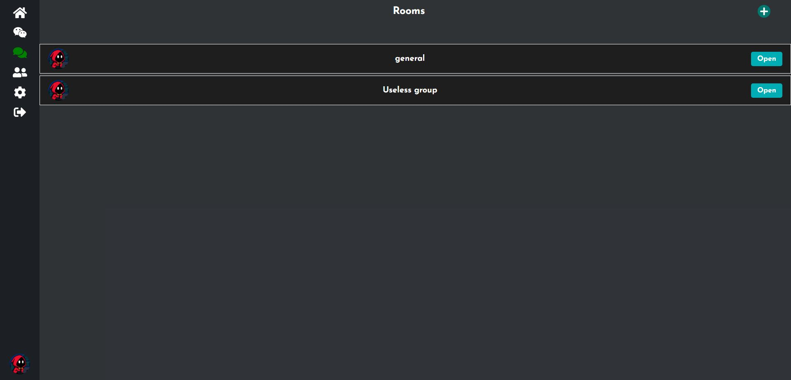

# <div style="display:flex; align-items: center; gap: 20px;">  Connect - Frontend </div>
> This repository holds the frontend for Connect, a modern application designed to facilitate real-time chat and seamless communication.

[](https://github.com/AdityaByte/Connect-Frontend/blob/main/LICENSE)
[](https://github.com/AdityaByte/Connect-Frontend/commits/main)
[](https://github.com/AdityaByte/Connect-Frontend/actions)
[](https://github.com/AdityaByte/Connect-Frontend/stargazers)
[](https://reactjs.org/)
[](https://redux-toolkit.js.org/)
[](https://reactjs.org/docs/context.html)
[](https://developer.mozilla.org/docs/Web/API/Fetch_API)
[](https://developer.mozilla.org/docs/Web/JavaScript)
[](https://tailwindcss.com/)


## Features

* ⚡ Modern & Responsive UI – TailwindCSS-powered interface optimized for both small and large screens.
* 🔄 Real-Time Updates – Instant message rendering through backend integration.
* ⚙️ Async Operations – Clean use of Fetch API and async/await for API calls.
* 🧠 State Management – Efficient global state handling using Redux Toolkit and Context API.
* 🚨 Robust Error Handling – Graceful handling of UI and API errors.
* 🧼 Clean Codebase – Modular, maintainable, and scalable React architecture.

## Architecture


## Overview

| | |
|---|---|
|  <br/>  <br/>  <br/>  |  <br/>  <br/>  <br/>  |

## Technologies Used - Frontend

<p align="left">       </p>

## Getting Started
```bash
$ git clone https://github.com/AdityaByte/Connect-Frontend.git
$ cd Connect-Frontend
$ npm install
$ npm run dev
```

## 👤 Author

<div align="left">
  
</div>

**Aditya Pawar**
🚀 Software Developer
🌐 [GitHub](https://github.com/AdityaByte) • 📬 [Email](mailto:cybergeek563@.com)
